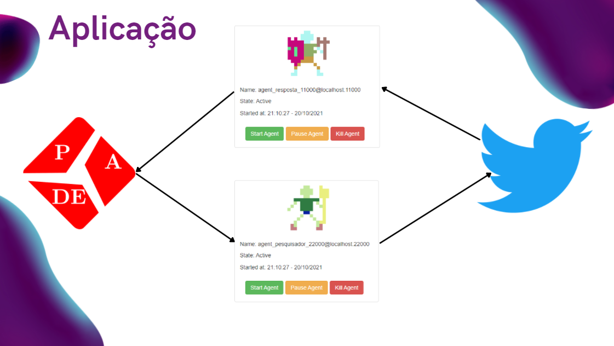

<h1 align="center">Sistemas MultiAgentes Python 👋</h1>

# Projeto :bomb:
Aplicação cria agentes para pesquisar tweets de hates de jogadoras na API do Twitter.
A biblioteca utilizada para auxilio da implementação é a PADE.
A aplicação cria agentes e buscam pelos nomes específicos no Twitter e um segundo agente retorna
o resultado esperado.

> Status do Projeto: em andamento :grey_exclamation:

## Pré-requisitos :question:
1. Python3 [Docker](https://www.docker.com/)
2. Pip3 [Docker](https://www.docker.com/)
3. Poetry [Docker](https://www.docker.com/):

Para instalar o poetry e gerenciar as dependencias do projeto.

`pip3 install poetry`

Ja dentro da pasta do projeto.

`poetry shell`

Para instalar as dependencias.

`poetry install`

## Executando :running:
Iniciar o banco de dados do PADE.

`pade create-pade-db`

Dentro da pasta **trabalho_ia2**, vamos executar o script **agent_example_1** na porta 2000.

`pade start-runtime agent_example_1.py --port 20000`

Para acessar o front da aplicação.

`http://172.19.167.225:5000/`

## Melhorias :trophy:
- [ ] Adicionar um terceiro agente e seus comportamentos para realizar o predict da mensagem recebida
e verificar qual o sentimento daquele tweet ódio, felicidade, tristeza.

 
 

